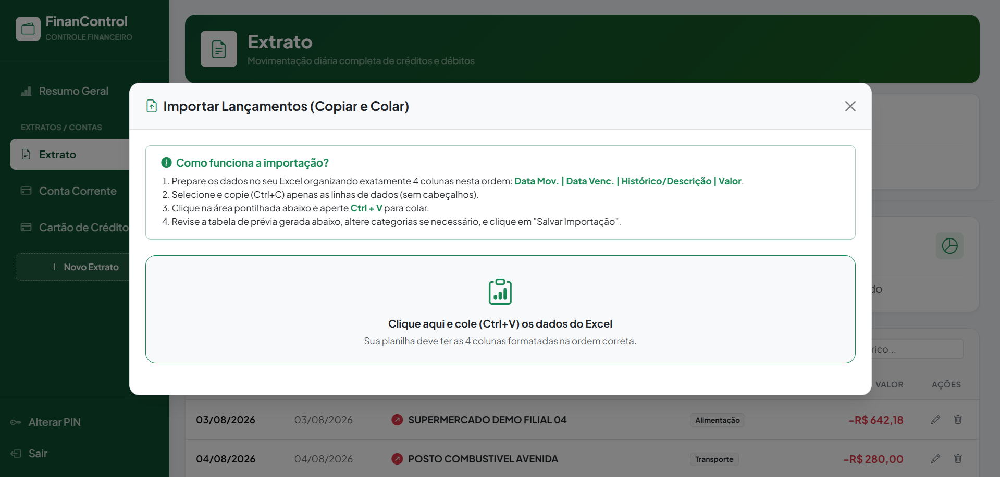

# 💰 ControleFinanceiroWeb

[](https://github.com/LeoLopesDev82/ControleFinanceiroWeb/actions/workflows/build.yml)
[](https://dotnet.microsoft.com/download)
[](LICENSE)

A personal finance web application built with ASP.NET Core MVC, used daily to
run a household's budget. It is a full web rewrite of an earlier Windows Forms
application, now responsive and reachable from any device on the home network.


## 🏡 Why it exists

It was built for one user: my wife. She ran the household budget from a
spreadsheet and kept hitting its edges — categories that had to be retyped, no
easy read on how the month was shaping up, and the file sitting on one
computer.

So I built her the thing she actually needed. ASP.NET Core was a deliberate
choice rather than a desktop application: it runs on one machine at home and
everyone reaches it from any browser in the house, phone included, instead of
passing a file around.

The spreadsheet did not go to waste either. Transactions are still brought in
by pasting rows straight out of Excel, which is why the import screen exists
at all — it was the bridge from how she already worked.

She has used it every month since, and that is the part I am happiest about.

## 🧾 Overview

The application tracks bank and credit card transactions across several
accounts, categorises them automatically from configurable keywords, and
consolidates everything into a dashboard with charts, category breakdowns and
a fixed-expense checklist.

Transactions are entered by hand or imported in bulk by pasting rows straight
out of a spreadsheet.

## ✅ Features

**Transactions**
- Add manually, or import in bulk by pasting tab-delimited rows from a
  spreadsheet, with a validated preview before anything is saved
- Filter by account and date range, defaulting to the current month
- Automatic categorisation by keyword matching on the description

**Categories**
- Full CRUD, with duplicate-name validation
- Keyword identifiers per category (`SUPERMERCADO|PADARIA` → *Alimentação*)
- Typed as fixed or variable cost, which drives the dashboard checklist

**Accounts**
- Manage statement types (chequing account, credit card, …)
- Deletion blocked while transactions still reference them

**Access**
- Shared 6-digit PIN, set by whoever opens the application for the first time
- Stored as a PBKDF2 hash, never in clear text
- Wrong attempts throttle progressively, from 30 seconds on the third to
  15 minutes, and the wait survives a restart
- A session belongs to one run of the application and to one browser window,
  so the PIN is asked for whenever either is started again, and the browser is
  told not to offer to save it
- Changing the PIN signs the other devices out, so they must enter the new one

**Dashboard**
- Income, expenses and balance for the selected period
- Accumulated cash-flow chart and expense distribution by category
- Fixed-expense checklist showing what is paid and what is still pending
- Uncategorised transactions surfaced for manual correction

Each account keeps its own statement, with the running credit, debit and
balance for the period on top of the entries:


Bulk entry is a paste away: copy the rows from a spreadsheet, drop them in,
and review the parsed preview before anything is written.



## 🛠️ Tech Stack

| Layer | Choice |
| --- | --- |
| Backend | ASP.NET Core MVC (net9.0), C#, LINQ, EF Core 9 |
| Database | Firebird 3.0 |
| Frontend | Razor views, Bootstrap 5, vanilla JavaScript (`fetch`), Chart.js |
| Testing | xUnit, EF Core in-memory provider |
| Local infra | Docker Compose |

## 🚀 Getting Started

Requires the [.NET 9 SDK](https://dotnet.microsoft.com/download) and
[Docker](https://www.docker.com/products/docker-desktop/).

```bash
git clone https://github.com/LeoLopesDev82/ControleFinanceiroWeb.git
cd ControleFinanceiroWeb
docker compose up -d
dotnet run --project ControleFinanceiroWeb --launch-profile "Docker database"
```

The container brings up Firebird with the schema and demo data already
applied, so there is nothing to install or configure. The demo data is
fictitious and dated relative to the current month, so the dashboard is
populated on first open.

The default launch profiles expect a local Firebird install instead; see
[`database/README.md`](database/README.md).

## 🧪 Tests

```bash
dotnet test
```

The suite is deliberately selective. It targets the rules that would be
expensive to get wrong rather than chasing coverage of plain CRUD:

- **Dashboard figures** — income and expenses split by sign, expenses reported
  as positive amounts, uncategorised spending grouped under *Outros*,
  percentage shares per category, and the fixed-expense checklist that marks a
  category paid only once its transaction carries a settlement date.
- **Spreadsheet import** — a valid row parsed into typed values, rows with
  missing columns or malformed dates flagged without discarding the rest of
  the batch, blank lines skipped, and categories assigned from keyword
  matching.
- **Account deletion** — refused while transactions still reference the
  account, which is an invariant held in code since the schema carries no
  foreign keys.
- **Helpers** — Brazilian currency and date parsing (`R$ 1.500,50` →
  `1500.50m`) and the data-annotation validation on the view models.

Service tests run against the EF Core in-memory provider. It is not a
relational engine: it enforces no constraints and does not translate SQL the
way Firebird does, so these tests exercise service logic rather than database
behaviour. Testing the latter would call for integration tests against a real
Firebird instance.

## 🏗️ Architecture

```
Controllers/   Thin HTTP layer: model binding, delegation, status codes
Services/      Business logic, one folder per domain, interface per service
Models/
  Entities/    EF Core entities mapped to the Firebird tables
  ViewModels/  Shapes for views and JSON endpoints
  ServiceResult Uniform success/message/id result returned by services
Data/          EF Core DbContext
Helpers/       Conversion and validation utilities
Views/         Razor views and partials
wwwroot/js/    Fetch-based client code, one file per screen
database/      Versioned SQL schema, demo data and setup scripts
```

A few decisions worth calling out:

- **Services return `ServiceResult`, not exceptions**, so controllers stay
  free of try/catch and map results to status codes in one line.
- **The schema is versioned as SQL, not EF Migrations.** A deliberate choice
  to keep control over the DDL and index strategy, and to keep the schema
  readable without running the application.
- **The database file is never committed.** It is generated from
  `database/schema.sql`, and `.gitignore` blocks `*.fdb` so that real
  financial data cannot be pushed by accident.
- **`appsettings.json` carries no credentials.** The connection string comes
  from `appsettings.Development.json`, user secrets, or the environment, and
  the application fails at startup with an explicit message when it is
  missing.
- **Entry types are a typed enum**, mapped to the underlying `CHAR(1)` through
  an EF Core value converter rather than passing `'F'`/`'V'` around.
- **A session belongs to one run of the application.** The cookie carries an
  identifier generated at startup, and a request whose identifier no longer
  matches is signed out. Session cookies alone were not enough: browsers that
  restore the previous session bring them back, so closing the window was no
  guarantee. Tying sessions to the process means starting the application asks
  for the PIN, which fits a household that opens it when needed and closes it
  afterwards. Left running as a permanent service the guarantee weakens to
  "until the next restart", and an idle timeout would be the better fit.
- **The PIN box is not a password field.** Browsers offer to remember what
  they recognise as a password and fill it back in later, which on a machine
  the household shares undoes the point of asking for a PIN at all. The field
  is a text input masked with `-webkit-text-security`, so the browser never
  sees a credential. Masking is presentational either way — a password field
  does not hide the value from the page either — but this way it depends on
  the stylesheet loading, so the script restores a password field where the
  property is unsupported. It suits a home setup; anyone who would rather have
  the conventional behaviour can set the inputs back to `type="password"`.
- **All database access is asynchronous**, end to end.

## 🗺️ Roadmap

Known gaps, in the order they are worth closing:

- [ ] Rate limit at the HTTP layer as well, so the throttle also covers requests that never reach the PIN check

## 📄 License

[MIT](LICENSE)
