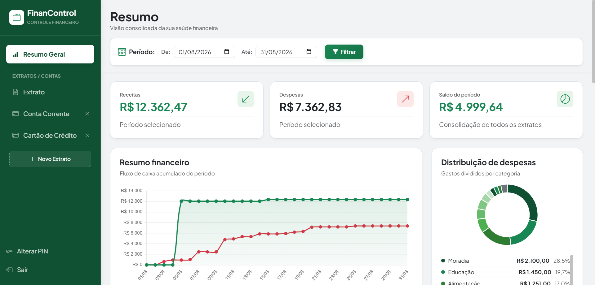

# 💰 ControleFinanceiroWeb

A personal finance web application built with ASP.NET Core MVC, used daily to
run a household's budget. It is a full web rewrite of an earlier Windows Forms
application, now responsive and reachable from any device on the home network.

> Screenshots: replace the two files under `docs/` with your own captures.



## 🧾 Overview

The application tracks bank and credit card transactions across several
accounts, categorises them automatically from configurable keywords, and
consolidates everything into a dashboard with charts, category breakdowns and
a fixed-expense checklist.

Transactions are entered by hand or imported in bulk by pasting rows straight
out of a spreadsheet.

## ✅ Features

**Transactions**
- Add manually, or import in bulk by pasting tab-delimited rows from a
  spreadsheet, with a validated preview before anything is saved
- Filter by account and date range, defaulting to the current month
- Automatic categorisation by keyword matching on the description

**Categories**
- Full CRUD, with duplicate-name validation
- Keyword identifiers per category (`SUPERMERCADO|PADARIA` → *Alimentação*)
- Typed as fixed or variable cost, which drives the dashboard checklist

**Accounts**
- Manage statement types (chequing account, credit card, …)
- Deletion blocked while transactions still reference them

**Dashboard**
- Income, expenses and balance for the selected period
- Accumulated cash-flow chart and expense distribution by category
- Fixed-expense checklist showing what is paid and what is still pending
- Uncategorised transactions surfaced for manual correction

## 🛠️ Tech Stack

| Layer | Choice |
| --- | --- |
| Backend | ASP.NET Core MVC (net9.0), C#, LINQ, EF Core 9 |
| Database | Firebird 3.0 |
| Frontend | Razor views, Bootstrap 5, vanilla JavaScript (`fetch`), Chart.js |
| Testing | xUnit |
| Local infra | Docker Compose |

## 🚀 Getting Started

Requires the [.NET 9 SDK](https://dotnet.microsoft.com/download) and
[Docker](https://www.docker.com/products/docker-desktop/).

```bash
git clone https://github.com/LeoLopesDev82/ControleFinanceiroWeb.git
cd ControleFinanceiroWeb
docker compose up -d
dotnet run --project ControleFinanceiroWeb --launch-profile "Docker database"
```

The container brings up Firebird with the schema and demo data already
applied, so there is nothing to install or configure. The demo data is
fictitious and dated relative to the current month, so the dashboard is
populated on first open.

The default launch profiles expect a local Firebird install instead; see
[`database/README.md`](database/README.md).

## 🧪 Tests

```bash
dotnet test
```

Covers the keyword-matching algorithm behind automatic categorisation, the
parsing helpers for Brazilian currency and date formats (`R$ 1.500,50` →
`1500.50m`), and the data-annotation validation on the view models.

## 🏗️ Architecture

```
Controllers/   Thin HTTP layer: model binding, delegation, status codes
Services/      Business logic, one folder per domain, interface per service
Models/
  Entities/    EF Core entities mapped to the Firebird tables
  ViewModels/  Shapes for views and JSON endpoints
  ServiceResult Uniform success/message/id result returned by services
Data/          EF Core DbContext
Helpers/       Conversion and validation utilities
Views/         Razor views and partials
wwwroot/js/    Fetch-based client code, one file per screen
database/      Versioned SQL schema, demo data and setup scripts
```

A few decisions worth calling out:

- **Services return `ServiceResult`, not exceptions**, so controllers stay
  free of try/catch and map results to status codes in one line.
- **The schema is versioned as SQL, not EF Migrations.** A deliberate choice
  to keep control over the DDL and index strategy, and to keep the schema
  readable without running the application.
- **The database file is never committed.** It is generated from
  `database/schema.sql`, and `.gitignore` blocks `*.fdb` so that real
  financial data cannot be pushed by accident.
- **`appsettings.json` carries no credentials.** The connection string comes
  from `appsettings.Development.json`, user secrets, or the environment, and
  the application fails at startup with an explicit message when it is
  missing.
- **Entry types are a typed enum**, mapped to the underlying `CHAR(1)` through
  an EF Core value converter rather than passing `'F'`/`'V'` around.
- **All database access is asynchronous**, end to end.

## 🗺️ Roadmap

Known gaps, in the order they are worth closing:

- [ ] Cookie authentication — the application currently has none
- [ ] Antiforgery tokens on the write endpoints
- [ ] Structured logging; several `catch` blocks still swallow the exception
- [ ] Service-level tests against an in-memory provider
- [ ] Fix horizontal overflow on narrow screens

## 📄 License

[MIT](LICENSE)
